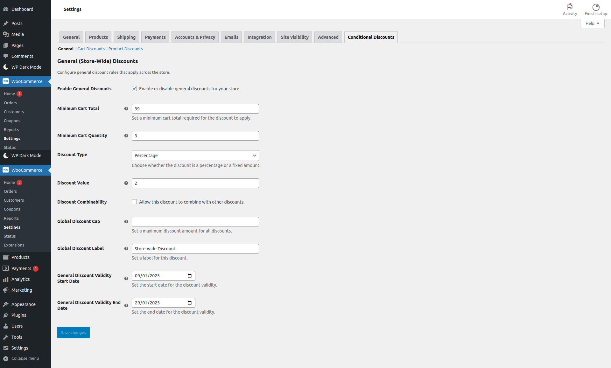
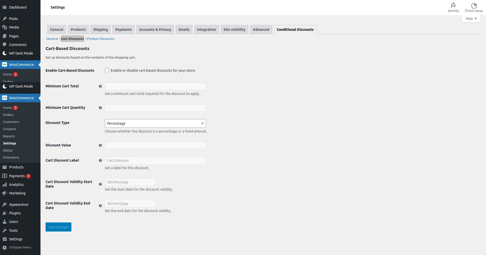
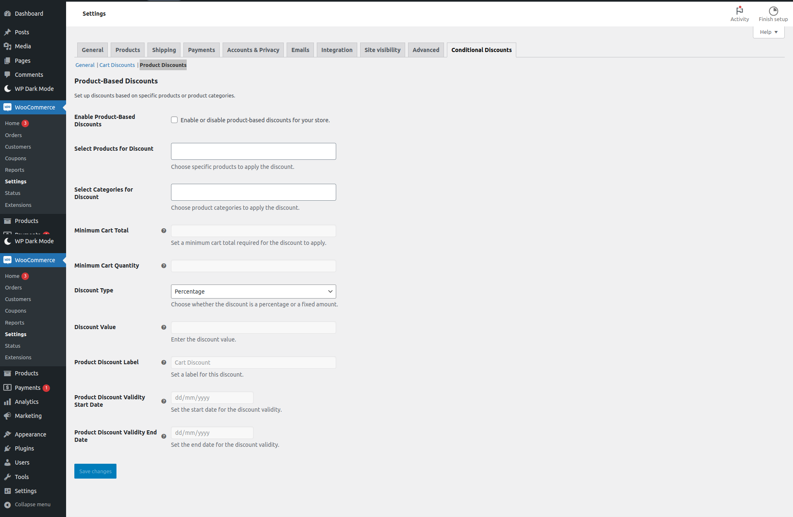
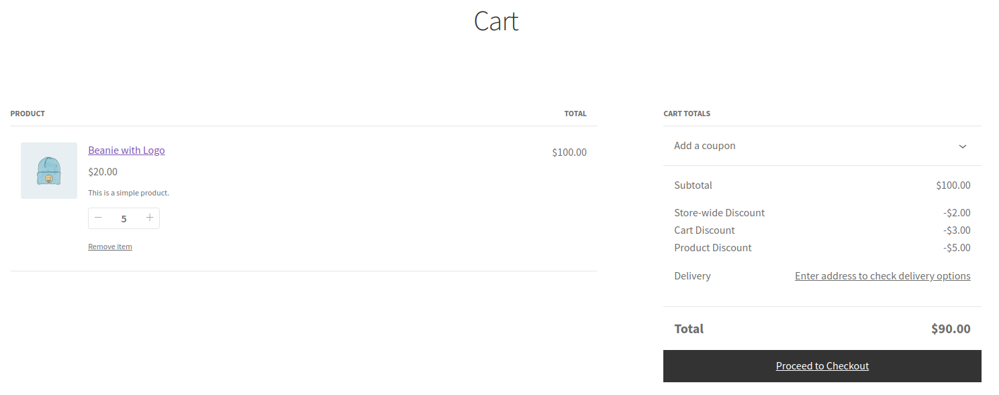

# Conditional Discounts for WooCommerce Plugin

The **Conditional Discounts for WooCommerce Plugin** plugin is designed to simplify creating and managing discounts for your WooCommerce store. You can configure general, cart-based, and product-specific discounts to maximize your store's potential.

## Features

### General Discounts

- **Enable/Disable General Discounts**: Apply discounts globally across your store.
- **Minimum Cart Total Requirement**: Set thresholds to activate discounts.
- **Minimum Cart Quantity Requirement**: Set quantity thresholds to activate discounts.
- **Discount Types**: Choose between percentage-based or fixed-amount discounts.
- **Custom Discount Labels**: Display custom text to explain the applied discount.
- **Flexible Discount Periods**: Configure start and end dates for limited-time offers.

### Cart-Based Discounts

- **Threshold Discounts**: Offer discounts based on cart totals or item quantities.
- **Flexible Discount Periods**: Configure start and end dates for limited-time cart-based offers.
- **Customizable Labels**: Add clear descriptions for cart discounts.

### Product-Specific Discounts

- **Product and Category Discounts**: Target specific products or categories.
- **Advanced Selectors**: Use enhanced selectors for easy product and category assignment.
- **Scalable Rules**: Define minimum quantities or amounts to qualify for discounts.
- **Flexible Discount Periods**: Configure start and end dates for limited-time product-based offers.

## Installation

1. Download the plugin ZIP file.
2. Navigate to your WordPress dashboard and go to **Plugins > Add New**.
3. Click **Upload Plugin** and select the downloaded ZIP file.
4. Click **Install Now**, and once the installation is complete, click **Activate Plugin**.

## Usage

### Accessing the Settings

1. Navigate to **WooCommerce > Settings**.
2. Click on the **Conditional Discounts** tab in the settings menu.
3. Configure discounts for each section:
   - **General Discounts**
   - **Cart Discounts**
   - **Product Discounts**

## Screenshots

## Frequently Asked Questions

### 1. What types of discounts can I create?

You can create percentage-based or fixed-amount discounts that apply globally, to specific cart conditions, or to individual products/categories.

### 2. Can I set time-sensitive discounts?

Yes, you can configure start and end dates for general, cart-based and product-based discounts.

### 3. How do I target specific products or categories?

Under **Product Discounts**, use the enhanced selectors to choose products or categories.

### 4. Can I disable discounts temporarily?

Yes, you can enable or disable discounts for each section independently. Discounts can be used in combination.

## Changelog

### 1.0.0

- Initial release.
- Added General, Cart-Based, and Product-Specific discount functionalities.

## License

This plugin is licensed under the [GPL-2.0-or-later License](https://www.gnu.org/licenses/gpl-2.0.html).

## Contributing

I welcome contributions to improve this plugin. Please submit a pull request or report issues on the GitHub repository.

---

Thank you!
